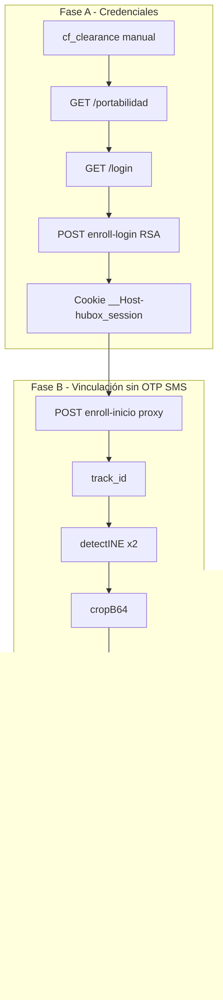

# Flujo completo con credenciales (sin OTP SMS)

Documentación cronológica del flujo **presencial** de vinculación Movistar vía Hubox: autenticación con **usuario y contraseña del portal**, sin depender del OTP que recibe el cliente por SMS.

> **Script de referencia:** `enroll_now.py`, `movistar_presencial.py login` + enroll manual  
> **Contraste:** el bot Telegram (`telegram_bot.py` + `enroll_automation.py`) sí usa OTP real al teléfono del usuario.

---

## Qué hace este flujo

Permite vincular una línea Movistar (`movistar_registro`) cuando el operador ya tiene:

- Credenciales de acceso al portal Hubox (`HUBOX_USER` / `HUBOX_PASSWORD`)
- Cookie Cloudflare (`CF_CLEARANCE`)
- Archivos del titular: anverso INE, selfie y datos OCR

La **sesión del portal** (`__Host-hubox_session`) reemplaza la necesidad de que el cliente escriba un código SMS. No se usa el flujo interactivo de OTP del bot.

---

## Requisitos previos

| Recurso | Dónde | Para qué |
|---------|-------|----------|
| `HUBOX_USER` | `.env` o `profiles/movistar_perfiles/config.json` | Usuario del portal presencial |
| `HUBOX_PASSWORD` | `.env` o config global | Contraseña del portal |
| `CF_CLEARANCE` | `.env` (captura Reqable/navegador) | Pasar Cloudflare |
| `HUBOX_ACCESS_KEY` | Default `ak_TelefonicaPruebas` | Identificador de integración |
| `HUBOX_AMBIENTE` | Default `movistar_prod` | Ambiente Hubox |
| Teléfono a vincular | 10 dígitos MX | Número destino de la línea |
| `front.jpg` | Carpeta de perfil | Anverso INE |
| `selfie.jpg` | Carpeta de perfil | Selfie para biometría |
| `ocr.json` | Carpeta de perfil | nombre, curp, clave_elector, direccion |

---

## Diferencia: con credenciales vs con OTP (bot)

| Aspecto | Flujo con credenciales (este doc) | Flujo con OTP (bot) |
|---------|-----------------------------------|---------------------|
| Autenticación operador | Login portal RSA | No hay login portal |
| Acceso al enroll | Sesión `__Host-hubox_session` | Solo `access_key` en API |
| Validación teléfono | Sesión portal (sin SMS al cliente) | `enroll_envia_otp` + OTP real del usuario |
| Interfaz | CLI (`enroll_now.py`) | Telegram (`telegram_bot.py`) |
| Perfiles | Archivos locales / paths manuales | Pool automático (`profile_pool.py`) |

---

## Cronología completa (12 pasos)

### Fase A — Acceso al portal (credenciales)

Extraída del HAR `movistar_acceso.har` y replicada en `movistar_presencial.py` / `hubox_login.py`.

#### Paso 1 — Cargar portal

```
GET https://registro-telefonica-movistar.hubox.com/portabilidad
```

- Carga la SPA de registro presencial.
- Debe ir acompañado de cookie `cf_clearance` válida.

#### Paso 2 — Cloudflare (manual)

```
POST /cdn-cgi/challenge-platform/.../jsd/oneshot/...
→ renueva cf_clearance
```

- No se automatiza offline: se copia `cf_clearance` desde Reqable o navegador.
- Sin este paso, el login responde *"Sin sesión válida"*.

#### Paso 3 — Pantalla de login

```
GET /login?redirect=%2Fportabilidad
```

- Prepara el contexto de autenticación (referer del login definitivo).

#### Paso 4 — Login con credenciales

```
POST /api/auth/enroll-login
Body: { "data": "<RSA-OAEP cifrado>" }
```

Payload en claro (antes de cifrar):

```json
{
  "action": "login",
  "user": "<HUBOX_USER>",
  "password": "<HUBOX_PASSWORD>",
  "ambiente": "movistar_prod",
  "tipo": 2,
  "access_key": "ak_TelefonicaPruebas"
}
```

Cifrado: `Base64(JSON)` → RSA-OAEP SHA-256 → Base64 (distinto al de `enroll_inicio`).

**Resultado esperado:**

- `{ "success": true }`
- Cookie `__Host-hubox_session` (JWT, TTL ~600 s)

#### Paso 5 — Verificar sesión

- Comprobar que la cookie `__Host-hubox_session` está en la sesión HTTP.
- Todas las peticiones siguientes reutilizan la misma `requests.Session`.

---

### Fase B — Vinculación (sin OTP SMS al cliente)

Con sesión activa. Referencia: `enroll_now.py`.

#### Paso 6 — Inicio de enroll (proxy portal)

```
POST https://registro-telefonica-movistar.hubox.com/api/auth/enroll-inicio
Body: { "data": "<RSA-OAEP cifrado>" }
```

Payload en claro:

```json
{
  "numero": "5512345678",
  "flujo": "movistar_registro",
  "tipo_doc": "ine",
  "access_key": "ak_TelefonicaPruebas",
  "ambiente": "movistar_prod"
}
```

Cifrado: `UTF-8(JSON)` → RSA-OAEP SHA-256 → Base64 (igual que `enroll_replay.py`).

**Resultado:** `track_id` (UUID de la vinculación).

> **Nota:** Este paso va al **proxy del portal**, no directo a `api-v1.hubox.com/enroll_inicio`, porque la sesión del operador está en el frontend.

#### Paso 7 — Detectar INE (primera pasada)

```
POST https://api-v1.hubox.com/enroll_detectINE
Body: { "img": "<base64 anverso>", "access_key": "..." }
```

- Envía el anverso INE en base64.
- Primera llamada de “calentamiento” (patrón observado en producción).

#### Paso 8 — Detectar INE (segunda pasada + recorte)

```
POST https://api-v1.hubox.com/enroll_detectINE
```

**Resultado:** `cropB64` — recorte del documento para OCR y QRs.

---

#### Paso 9 — OCR del INE

```
POST https://api-v1.hubox.com/enroll_ocr
Body: {
  "img": "<cropB64>",
  "track_id": "<uuid>",
  "access_key": "..."
}
```

- Hubox extrae/valida datos biográficos.
- Se cruza con `ocr.json` local si hace falta completar campos.
- Error conocido: `CURP_MAX_10` → perfil agotado (máx. 10 vinculaciones por CURP).

#### Paso 10 — Generar códigos QR (servicio INE)

```
POST https://ine-services-2026.hubox.com/ine-services/genera-qrs
Body: {
  "biograficos": "<string pipe-delimited>",
  "fotografia": "<cropB64>",
  "huellas": []
}
```

- `biograficos` se construye desde OCR (CURP, clave elector, nombre, dirección, entidad federativa).
- **Resultado:** `bytesQrs[0]` y `bytesQrs[1]`.

#### Paso 11 — Enviar QRs a Hubox

```
POST https://api-v1.hubox.com/enroll_qrs
Body: {
  "qr_b64_1": "...",
  "qr_b64_2": "...",
  "track_id": "<uuid>",
  "access_key": "..."
}
```

#### Paso 12 — Biometría facial

```
POST https://api-v1.hubox.com/enroll_biometric
Body: {
  "farFace": "<selfie base64>",
  "closeFace": "<selfie base64>",
  "devices": "camera 1, facing front 480x640",
  "track_id": "<uuid>",
  "access_key": "..."
}
```

- En automatización se usa la **misma selfie** para `farFace` y `closeFace`.
- **Resultado exitoso:** `{ "success": true, "similarity": "...", "prediction": "REAL", "curp": "...", ... }`

---

## Lo que NO entra en este flujo

Estos pasos pertenecen al flujo **con OTP** (bot / `enroll_automation.py`) y **no se documentan aquí** como parte del camino presencial:

| Paso omitido | Endpoint | Motivo |
|--------------|----------|--------|
| Enviar OTP SMS | `POST /enroll_envia_otp` | El cliente no recibe ni escribe código |
| Validar OTP SMS | `POST /enroll_valida_otp` | Sustituido por sesión portal autenticada |

> En pruebas antiguas (`enroll_now.py`) aún aparecen esas llamadas con OTP `"0000"` como atajo experimental; el flujo de producción presencial documentado aquí **no las requiere** cuando la sesión portal es válida.

---

## Diagrama cronológico



---

## Archivos del proyecto implicados

| Archivo | Rol en este flujo |
|---------|-------------------|
| `movistar_presencial.py` | Implementación completa login + enroll (tiene OTP opcional en modo `full`; usar solo login + pasos manuales para este doc) |
| `enroll_now.py` | Script mínimo de referencia: login → inicio → detect → ocr → qrs → bio |
| `hubox_login.py` | Solo pasos 1–5 (login portal) |
| `movistar_acceso.har` | Captura original del login presencial |
| `har_assets/` | Imágenes de ejemplo extraídas del HAR |
| `.env` | Credenciales y `CF_CLEARANCE` |

**No necesarios** para este flujo:

- `telegram_bot.py`, `bot_store.py` — flujo con OTP y keys
- `enroll_automation.py` — orquestación bot sin login portal
- `profile_pool.py` — pool automático del bot (opcional si usas paths manuales)

---

## Cómo ejecutarlo

### Solo login (pasos 1–5)

```powershell
$env:CF_CLEARANCE = "<cookie>"
$env:HUBOX_USER = "<usuario>"
$env:HUBOX_PASSWORD = "<password>"

python movistar_presencial.py login
```

### Flujo completo de referencia (`enroll_now.py`)

Editar teléfono, rutas de imágenes y credenciales en el script, luego:

```powershell
python enroll_now.py
```

---

## Constantes de red

| Constante | Valor |
|-----------|-------|
| Frontend | `https://registro-telefonica-movistar.hubox.com` |
| API enroll | `https://api-v1.hubox.com` |
| API INE QRs | `https://ine-services-2026.hubox.com/ine-services` |
| Flujo | `movistar_registro` |
| Access key | `ak_TelefonicaPruebas` |
| Ambiente | `movistar_prod` |

---

## Errores frecuentes

| Error | Causa probable |
|-------|----------------|
| *Sin sesión válida* en login | `cf_clearance` ausente o expirada |
| *Credenciales inválidas* | `HUBOX_USER` / `HUBOX_PASSWORD` incorrectos |
| Sin `track_id` en inicio | Sesión expirada (>600 s) o payload mal cifrado |
| `CURP_MAX_10` | Perfil/CURP ya usado 10 veces en Hubox |
| Biometría rechazada | Selfie no coincide con foto INE o calidad baja |

---

## Resumen en una línea

**Cloudflare → login portal (credenciales) → enroll-inicio con sesión → INE/OCR/QRs/biometría → vinculación OK**, sin pedir OTP por SMS al cliente final.
