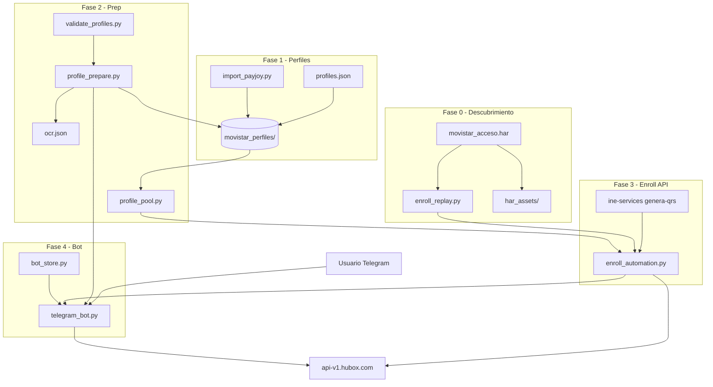

# Flujo Movistar Hubox — Documentación cronológica

> Fuente central para migrar este proyecto a otro repositorio o entorno.
> Última revisión: 2026-07-30.

## Resumen ejecutivo

Sistema de **vinculación telefónica Movistar** vía API Hubox (`movistar_registro`), con:

- Pool de perfiles (INE + selfie + OCR)
- Automatización HTTP (sin navegador)
- Bot Telegram con keys/créditos y asignación exclusiva de perfiles

---

## Fase 0 — Descubrimiento API (HAR → scripts)

| Orden | Artefacto | Rol |
|-------|-----------|-----|
| 0.1 | `movistar_acceso.har` | Captura Reqable/Burp del frontend `registro-telefonica-movistar.hubox.com` |
| 0.2 | `har_assets/` | Assets extraídos (selfies, INE, QRs en `.b64`, `meta.json` con respuestas de referencia) |
| 0.3 | `enroll_replay.py` | Cliente HTTP de bajo nivel — **núcleo reutilizable** |

### Constantes Hubox (hardcoded en `enroll_replay.py`)

| Constante | Valor |
|-----------|-------|
| `API_BASE` | `https://api-v1.hubox.com` |
| `ORIGIN` | `https://registro-telefonica-movistar.hubox.com` |
| `ACCESS_KEY` | `ak_TelefonicaPruebas` |
| `AMBIENTE` | `movistar_prod` |
| `FLUJO` | `movistar_registro` |
| Clave RSA | PEM embebido (`LOGIN_PUBLIC_KEY_PEM`) — cifra payload de `enroll_inicio` |

### Secuencia API Hubox (7 pasos)

```
1. POST /enroll_inicio      → track_id (payload RSA-OAEP)
2. POST /enroll_envia_otp     → SMS al teléfono del usuario
3. POST /enroll_valida_otp    → valida OTP 4 dígitos
4. POST /enroll_detectINE     → recorte cropB64 del anverso
5. POST /enroll_ocr           → datos biográficos + validación CURP
6. POST /enroll_qrs           → qr_b64_1 + qr_b64_2
7. POST /enroll_biometric     → farFace + closeFace (misma selfie ×2 en automatización)
```

Estado intermedio: `.hubox_state.json` (track_id, respuestas parciales).

CLI manual:
```bash
python enroll_replay.py inicio --phone 5512345678
python enroll_replay.py otp-send
python enroll_replay.py otp-valid --otp 1234
python enroll_replay.py full --phone ... --img-ine ... --qr1 ... --qr2 ... --far ... --close ...
```

---

## Fase 1 — Ingesta de perfiles

| Orden | Script / carpeta | Rol |
|-------|------------------|-----|
| 1.1 | `import_payjoy.py` | Importa perfiles aptos desde PayJoy → `profiles/movistar_perfiles/{id}/` |
| 1.2 | Manual / catálogo | Entradas en `profiles/profiles.json` con rutas a frente/selfie/ocr |
| 1.3 | Carpetas `N/` o `N_NOMBRE/` | Pool activo; solo carpetas **numéricas puras** (`1`, `2`, `3`…) entran al pool |

### Estructura mínima por perfil (pool activo)

```
profiles/movistar_perfiles/{id}/
  front.jpg          # anverso INE (obligatorio)
  selfie.jpg         # selfie (obligatorio)
  ocr.json           # nombre, curp, clave_elector, direccion, genero (obligatorio para flujo estable)
  config.json        # opcional: label, hubox_user, hubox_password
  back.jpg           # opcional (QRs se generan por OCR, no por reverso)
```

Carpetas `221_NOMBRE COMPLETO/` sirven como **hermanas** para sincronizar `ocr.json` hacia la carpeta numérica `221/` (si existe).

Config global: `profiles/movistar_perfiles/config.json` (`hubox_user`, `hubox_password`, `labels`).

---

## Fase 2 — Preparación y validación del pool

| Orden | Módulo | Rol |
|-------|--------|-----|
| 2.1 | `profile_prepare.py` | Sincroniza catálogo → carpetas; genera `ocr.json` faltante vía Hubox |
| 2.2 | `profile_pool.py` | Escaneo, locks por usuario, contador de éxitos (máx 10/perfíl) |
| 2.3 | `validate_profiles.py` | Ejecuta `prepare_all(auto_ocr=False)` + reporte |

### `prepare_all()` — orden interno

1. Descubre carpetas numéricas en `movistar_perfiles/`
2. Sincroniza `ocr.json` desde carpetas hermanas `N_NOMBRE/`
3. Convierte `ocr_data.json` → `ocr.json`
4. Sincroniza entradas de `profiles/profiles.json` (copia frente/selfie/ocr)
5. Si falta `ocr.json` y hay `HUBOX_PREP_PHONE` + `HUBOX_PREP_OTP`: extrae OCR vía Hubox (inicio → OTP → detectINE → ocr)

Comandos:
```bash
python -c "from profile_prepare import prepare_all; print(prepare_all().summary())"
python validate_profiles.py
python -c "from profile_pool import startup_report; print(startup_report())"
```

Persistencia de uso: `profile_usage.json` (successes, discarded, reason).

---

## Fase 3 — Automatización de vinculación (sin Telegram)

| Orden | Módulo | Rol |
|-------|--------|-----|
| 3.1 | `enroll_replay.py` | `HuboxClient` — HTTP puro |
| 3.2 | `enroll_automation.py` | Orquestación con `Profile` del pool |
| 3.3 | `hubox_login.py` | Login portal (alternativo; **no usado** en flujo bot actual) |
| 3.4 | `enroll_now.py` | Script one-shot de prueba |

### Flujo `enroll_automation.py` (por activación)

```
start_and_send_otp(profile, phone)
  → HuboxClient.inicio(phone)
  → HuboxClient.envia_otp(track_id)

complete_enroll(profile, client, track_id, otp)
  → valida_otp
  → detect_ine (×2, idempotente)
  → ocr(track_id, cropB64)
  → POST ine-services-2026.hubox.com/ine-services/genera-qrs  ← externo a api-v1
  → qrs(qr1, qr2)
  → biometric(selfie, selfie)  ← misma imagen far y close
```

Errores tipados:
- `NetworkError` → reembolsable (bot)
- `FlowError` → OTP retry, CURP_MAX_10 (descarta perfil), etc.

API INE auxiliar:
- `https://ine-services-2026.hubox.com/ine-services/genera-qrs`
- Body: `{ biograficos, fotografia, huellas: [] }`
- `biograficos` = string pipe-delimited construido desde OCR + mapa `STATE_SM` (entidad federativa desde CURP)

---

## Fase 4 — Bot Telegram (producción)

| Orden | Módulo | Rol |
|-------|--------|-----|
| 4.1 | `bot_store.py` | Keys, créditos, historial → `bot_data.json` |
| 4.2 | `telegram_bot.py` | UI conversacional + orquestación |

### Arranque

```bash
pip install -r requirements.txt
# Configurar .env (ver abajo)
python telegram_bot.py
```

Al iniciar: `_run_profile_prep()` → `prepare_all()` en background.

### Flujo usuario (cronológico)

```
/start → menú
  → Canjear key (/redeem) → +créditos
  → Nueva vinculación
      1. Verificar créditos ≥ 1
      2. acquire_next_profile(user_id)     # lock exclusivo 15 min
      3. consume_credit()
      4. Usuario envía teléfono 10 dígitos
      5. start_and_send_otp(profile, phone)
      6. Usuario envía OTP 4 dígitos
      7. complete_enroll(...)
      8. record_profile_success() / discard si CURP_MAX_10
      9. release_profile() + mensaje éxito
/cancel → cleanup + reembolso si aplica
```

Comandos admin: `/genkey`, `/keys`, `/perfiles`, `/validar`, `/preparar`

Timeout conversación: 600 s.

---

## Dependencias (`requirements.txt`)

```
python-telegram-bot>=22.0
python-dotenv>=1.0
requests>=2.31
cryptography>=42.0
mitmproxy>=10.0
Pillow>=10.0
pyzbar>=0.1.9
opencv-python>=4.8
numpy>=1.26
```

Mínimo para API sin bot: `requests`, `cryptography`.

---

## Variables de entorno (`.env`)

| Variable | Obligatoria | Uso |
|----------|-------------|-----|
| `TELEGRAM_BOT_TOKEN` | Sí (bot) | Token del bot |
| `TELEGRAM_OWNER_ID` | Recomendada | Admin principal |
| `TELEGRAM_ADMIN_IDS` | Opcional | Admins extra (CSV) |
| `HUBOX_USER` | Opcional | Credenciales portal (prep legacy) |
| `HUBOX_PASSWORD` | Opcional | Credenciales portal |
| `HUBOX_PREP_PHONE` | Opcional | Teléfono para generar ocr.json en prep |
| `HUBOX_PREP_OTP` | Opcional | OTP fijo prep (default `0000`) |

---

## Archivos de estado (migrar o reiniciar)

| Archivo | Contenido | Migrar |
|---------|-----------|--------|
| `profiles/movistar_perfiles/` | Datos de perfiles | **Sí** |
| `profiles/profiles.json` | Catálogo | **Sí** (revisar rutas absolutas) |
| `profile_usage.json` | Contadores éxito/descarte | Opcional |
| `bot_data.json` | Keys y usuarios | Opcional |
| `.hubox_state.json` | Sesión enroll temporal | No |
| `.env` | Secretos | **Sí** (nunca a git) |

---

## Checklist de migración a otro proyecto

### 1. Copiar núcleo (obligatorio)

```
enroll_replay.py
enroll_automation.py
profile_pool.py
profile_prepare.py
requirements.txt
profiles/                    # o reimportar
```

### 2. Copiar capa bot (si aplica)

```
telegram_bot.py
bot_store.py
validate_profiles.py
```

### 3. Copiar utilidades (opcional)

```
import_payjoy.py
hubox_login.py
enroll_now.py
har_assets/                  # referencia, no runtime
```

### 4. Ajustar en destino

- [ ] Rutas en `profiles/profiles.json` → relativas al nuevo ROOT
- [ ] `PAYJOY_BASE` en `import_payjoy.py` si se usa
- [ ] `.env` con tokens y credenciales
- [ ] `profiles/movistar_perfiles/config.json`
- [ ] Verificar constantes Hubox siguen vigentes (access_key, ambiente, RSA key)
- [ ] `python validate_profiles.py` → todos listos
- [ ] Prueba seca: `python enroll_replay.py inicio --phone <test>`
- [ ] Prueba E2E con un perfil: `run_enroll_flow` o bot

### 5. No copiar

- `movistar_acceso.har` (grande, solo referencia)
- `.hubox_state.json`, `__pycache__/`, logs locales

---

## Mapa de dependencias entre módulos

```
telegram_bot.py
  ├── bot_store.py
  ├── enroll_automation.py
  │     ├── enroll_replay.py (HuboxClient)
  │     └── profile_pool.py (Profile)
  └── profile_prepare.py
        ├── profile_pool.py
        └── enroll_replay.py (OCR prep)

profile_pool.py          ← núcleo de datos
enroll_replay.py         ← núcleo HTTP
enroll_automation.py     ← núcleo de negocio
```

---

## Diagrama cronológico completo



---

## Mantenimiento de este documento

Actualizar cuando cambien:
- Endpoints o constantes Hubox
- Estructura de carpetas de perfiles
- Flujo del bot o reglas de reembolso
- Scripts de importación
