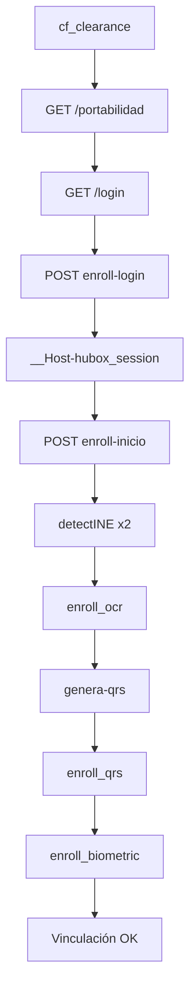

# Flujo presencial con credenciales (sin OTP)

Vinculación Movistar Hubox para operador **presencial**: login con usuario/contraseña del portal. **No usa OTP SMS** al teléfono del cliente.

> Script: `movistar_presencial.py`  
> Contraste: el bot Telegram (`telegram_bot.py`) sí pide OTP — ese es otro flujo.

---

## Qué es

El operador entra al portal `registro-telefonica-movistar.hubox.com` con credenciales Hubox, obtiene sesión (`__Host-hubox_session`) y ejecuta la vinculación de una línea con INE + selfie. La autenticación del operador la resuelve el login; **no hay pasos `enroll_envia_otp` ni `enroll_valida_otp`**.

---

## Requisitos

| Variable / archivo | Uso |
|--------------------|-----|
| `CF_CLEARANCE` | Cookie Cloudflare (Reqable/navegador) |
| `HUBOX_USER` | Usuario portal |
| `HUBOX_PASSWORD` | Contraseña portal |
| `--phone` | Teléfono a vincular (10 dígitos MX) |
| `--frente` | Anverso INE |
| `--selfie` | Selfie biometría |
| `--ocr` | `ocr.json` (nombre, curp, clave_elector, direccion) |

---

## Cronología completa (12 pasos)

### Fase A — Login (credenciales)

| # | Request | Descripción |
|---|---------|-------------|
| 1 | `GET /portabilidad` | Carga portal presencial |
| 2 | Cloudflare | `cf_clearance` manual (HAR: challenge JSD) |
| 3 | `GET /login?redirect=%2Fportabilidad` | Pantalla login |
| 4 | `POST /api/auth/enroll-login` | Credenciales cifradas RSA → sesión |
| 5 | Verificar cookie | `__Host-hubox_session` (JWT ~600 s) |

**Payload login (antes de cifrar):**

```json
{
  "action": "login",
  "user": "<HUBOX_USER>",
  "password": "<HUBOX_PASSWORD>",
  "ambiente": "movistar_prod",
  "tipo": 2,
  "access_key": "ak_TelefonicaPruebas"
}
```

Cifrado login: `Base64(JSON)` → RSA-OAEP SHA-256 → Base64.

---

### Fase B — Vinculación (sin OTP)

| # | Request | Host | Descripción |
|---|---------|------|-------------|
| 6 | `POST /api/auth/enroll-inicio` | Portal | Inicia enroll; devuelve `track_id` |
| 7 | `POST /enroll_detectINE` ×2 | api-v1 | Anverso INE → `cropB64` |
| 8 | `POST /enroll_ocr` | api-v1 | OCR del recorte |
| 9 | `POST /genera-qrs` | ine-services | Genera QR1 y QR2 |
| 10 | `POST /enroll_qrs` | api-v1 | Sube QRs |
| 11 | `POST /enroll_biometric` | api-v1 | Selfie (far + close) |

**Payload inicio (antes de cifrar):**

```json
{
  "numero": "5512345678",
  "flujo": "movistar_registro",
  "tipo_doc": "ine",
  "access_key": "ak_TelefonicaPruebas",
  "ambiente": "movistar_prod"
}
```

Cifrado inicio: `UTF-8(JSON)` → RSA-OAEP SHA-256 → Base64 (distinto al login).

**Resultado exitoso:** `{ "success": true, "similarity": "...", "prediction": "REAL", "curp": "..." }`

---

## Lo que NO incluye este flujo

| Endpoint | Flujo bot (con OTP) |
|----------|---------------------|
| `POST /enroll_envia_otp` | Envía SMS al cliente |
| `POST /enroll_valida_otp` | Cliente escribe código |

En presencial la sesión del operador autenticado sustituye esa validación.

---

## Diagrama



---

## Ejecución

```powershell
$env:CF_CLEARANCE = "<cookie>"
$env:HUBOX_USER = "<usuario>"
$env:HUBOX_PASSWORD = "<password>"

# Solo login
python movistar_presencial.py login

# Flujo completo
python movistar_presencial.py full `
  --phone 5512345678 `
  --frente profiles/movistar_perfiles/1/front.jpg `
  --selfie profiles/movistar_perfiles/1/selfie.jpg `
  --ocr profiles/movistar_perfiles/1/ocr.json
```

Estado guardado en `.hubox_presencial_state.json`.

---

## Constantes

| Clave | Valor |
|-------|-------|
| Frontend | `https://registro-telefonica-movistar.hubox.com` |
| API | `https://api-v1.hubox.com` |
| INE QRs | `https://ine-services-2026.hubox.com/ine-services` |
| Flujo | `movistar_registro` |
| Ambiente | `movistar_prod` |

---

## Errores frecuentes

| Error | Causa |
|-------|-------|
| Sin sesión válida | `cf_clearance` faltante o expirada |
| Credenciales inválidas | User/password incorrectos |
| Sin track_id | Sesión expirada o cifrado mal |
| CURP_MAX_10 | Perfil agotado (10 vinculaciones) |

---

## Resumen

**Cloudflare → login con credenciales → enroll-inicio → INE → OCR → QRs → biometría.** Sin OTP SMS.
